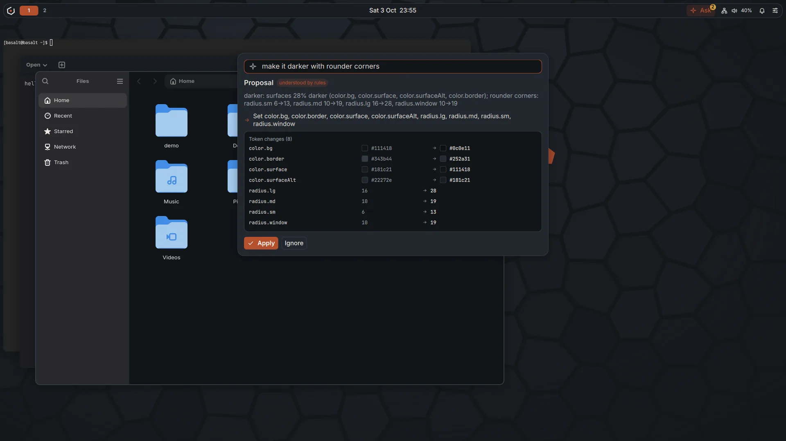
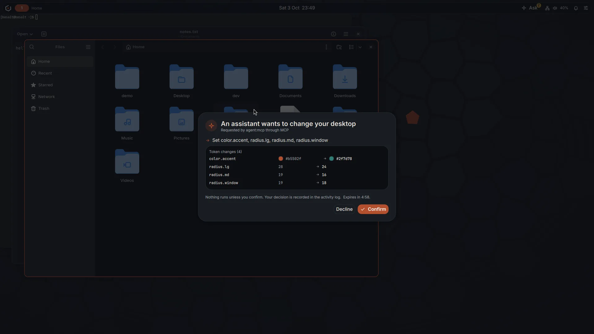
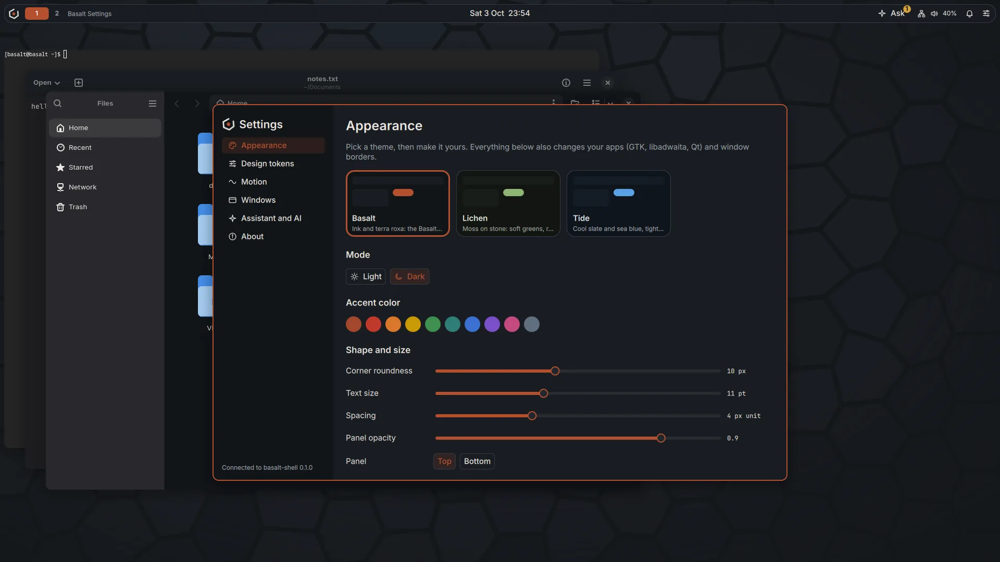
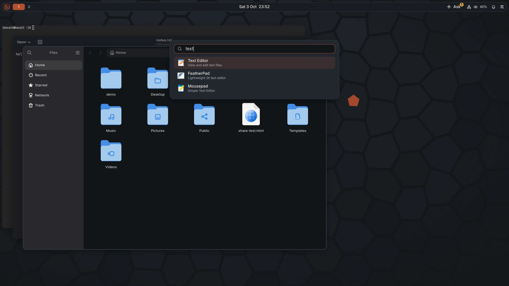
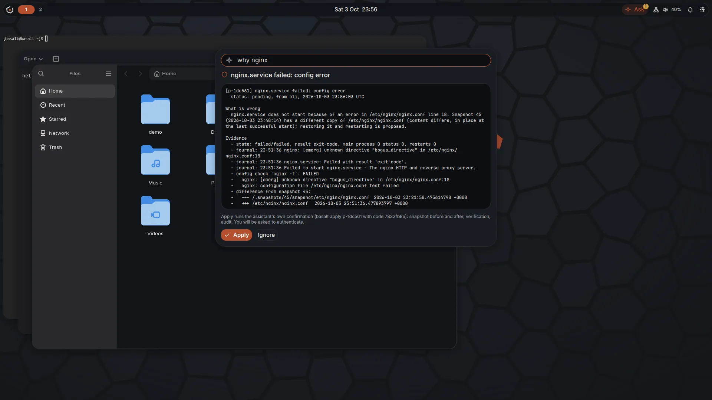

# basalt-shell

> Pre-release prototype (0.9.3). Expect breaking changes. Part of
> [Basalt OS](https://basalt-os.org), a Linux distribution built as a
> Fedora remix; not affiliated with or endorsed by the Fedora Project or
> Red Hat.

The desktop shell of Basalt OS: a panel, an application launcher,
notifications, quick settings, an "Ask the system" command bar and an
activity feed, all drawn from one set of design tokens that anyone can
change live from a settings page. A model, local by default, can
coordinate the whole desktop through typed actions (windows, workspaces,
applications, theme, notifications, settings) over a local MCP server;
every change it asks for waits for the person's confirmation on a sheet in
the shell and is written to a hash-chained activity log. Only the shell
UI's SELinux domain can confirm; agents run confined and can only ask.

Hold Super+V and speak: speech is turned into text on the computer
(whisper.cpp; nothing is kept), and the words go into the focused text
field as dictation, or to the assistant, which can find files, read and
summarize e-mail and web pages, reply to an e-mail, and move or rename
files. Every action is shown exactly and waits for the person's
confirmation; content the assistant reads is treated as data, never as
instructions ([docs/voice.md](docs/voice.md)).

Settings, Additional drivers, finds the graphics hardware and, on Basalt
OS, installs the NVIDIA driver for Turing and newer GPUs from the opt-in
basalt-nonfree repository: it shows what changes and the NVIDIA license
first, goes through the system assistant's confirmation, and after a
failed first start explains why and offers the rollback
([docs/design.md](docs/design.md#additional-drivers)).

Settings, Updates and channels checks for updates and installs them with
a snapshot first, undoes the last update, and turns Basalt OS's channels
(testing ones with a clear consent) and other software sources on and
off, each one through the system assistant's confirmation and with its
signing key shown ([docs/design.md](docs/design.md#updates-and-channels)).

Settings, Keyboard sets your layouts (search by name, reorder, remove;
Brazilian ABNT2, US international and every layout of the system's XKB
data), the switch key, Caps Lock, a compose key and key repeat, live and
for you only; the panel shows the layout in use. "Use my layouts there
too" asks the system assistant to set them for the login screen and new
accounts, with the same confirmation as every system change
([docs/design.md](docs/design.md#keyboard)).

The shell runs on sway (the default; on SwayFX, when installed, with
rounded corners, shadows, blur and dimmed inactive windows from the
theme's tokens, turned off on weak hardware; also headless, without a
display or GPU, for agents in VMs and servers) and, optionally, on niri
(the basalt-shell-niri package), through one adapter interface. Windows
float by default; tiling is one key away.



| | |
|---|---|
|  |  |
| An agent's request over MCP waits for the person | Settings: every change applies live, to the shell and to apps |
|  |  |
| The launcher | The command bar asking the Basalt OS system assistant |

More screenshots and short recordings are in [media/](media/).

## Status

A working prototype, not yet a release: everything below runs on sway and
niri on Fedora 44, in a lab VM and in the container described under "Try
it". Before 1.0 it still needs more typed actions, an independent review
of the confirmation boundary, and translations. The
packages are not yet in a public repository; until they are, build them
from source (below) or try the shell in a container.

## Pieces

| Piece | What |
|---|---|
| `basalt-shelld` | the daemon. Go, no third-party modules. Desktop state from the compositor adapter, design tokens and themes, the closed set of typed actions, proposals and confirmations, the audit log, the local socket (peer checked by SELinux context), application appearance (GTK, libadwaita, Qt 5 and 6, portals), screen capture and virtual input for agents |
| `basalt-shell-ui` | Quickshell (Qt 6 / QML): panel, launcher, command bar, confirmation sheet, agent-control indicator, quick settings, notification center, activity feed, settings window, polkit dialog, wallpaper, lock screen |
| `basalt-lock` | locks the session (Super+L, the power menu, idle, before sleep, `loginctl lock-session`): the shell's lock screen through ext-session-lock-v1, unlocked only by PAM (`/etc/pam.d/basalt-lock`); a themed swaylock when the shell UI is not running or stops while locked |
| `basalt-shell mcp` | MCP server on stdio for a local model or any MCP client (confined in `basalt_agent_mcp_t`) |
| `basalt-shell ctl`, `propose`, `screenshot` | the same from scripts |
| `basalt-greeter` | the login screen: a greetd greeter in Quickshell, run by a locked-down sway, confined in `basalt_greeter_t`; the text login (tuigreet) takes over when it cannot run ([docs/greeter.md](docs/greeter.md)) |
| `basalt-session sway, niri or headless` | starts a session; login entries "Basalt" and "Basalt (niri)"; `basalt-headless.service` |
| `selinux/` | the `basalt_shell` policy module (docs/selinux.md), built on the agent family's `basalt_agent_base` |

How it works and why: [docs/design.md](docs/design.md). The
confirmation boundary: [docs/selinux.md](docs/selinux.md). A desktop for
agents without a display: [docs/headless.md](docs/headless.md). The
command bar's local model: [docs/command-bar.md](docs/command-bar.md).
What the 0.1.0 prototype measured (SwayFX against niri):
[docs/prototype-report.md](docs/prototype-report.md).

## Try it

Pick one.

1. In a window of your current Wayland desktop, nothing installed on your
   system (podman, Mesa GPU):

   ```sh
   git clone https://github.com/basalt-os/basalt-shell.git
   cd basalt-shell
   scripts/try-podman.sh sway     # or: scripts/try-podman.sh niri
   ```

   The first run builds a Fedora 44 image with sway, niri and Quickshell
   (a few minutes). Close the window (or Super+Shift+E) to stop.

2. Installed on Fedora 44 or newer (everything from Fedora):

   ```sh
   scripts/install.sh
   scripts/try-nested.sh sway     # a nested window first, if you like
   ```

   Then log out and pick "Basalt" or "Basalt (niri)". The SELinux policy
   comes with the RPMs (`make rpm`).

3. Headless, for an agent: `systemctl --user start basalt-headless`
   ([docs/headless.md](docs/headless.md)).

4. On Basalt OS: `sudo dnf install basalt-shell` from the Basalt OS
   repository (<https://obpkg.org/basalt>) once a release that includes it
   is published. The installer's desktop profile
   (`basalt.profile=desktop`, see `lab/`) installs it with greetd and
   the Basalt login screen.

Keys: Super+Space launcher, Super+A command bar, Super+S quick settings,
Super+N notifications, Super+Comma settings, Super+Return terminal,
Super+T float or tile, Super+Q close, Super+Up maximize, Super+Left and
Super+Right snap, Super+Down restore, Super+H minimize (the panel's window
list brings it back), Super+Alt+Space window menu, Super+1..5 workspaces,
Super+Shift+Escape stop an agent's control session, Super+Shift+Space
next keyboard layout, Super+L lock,
Super+Shift+E the power menu (lock, log out, suspend, restart, power off;
also the power button at the right end of the panel and in quick
settings), Ctrl+Alt+Tab or Super+B the panel (then Left and Right along
it). Everything in the shell works with the keyboard: Tab and Shift+Tab
between groups, arrows inside them, Return or Space, Escape back to where
you came from ([docs/design.md](docs/design.md#keyboard-and-focus)).

Things to type in the command bar: "make it darker with rounder corners",
"light mode", "use the lichen theme", "accent green", "bigger text",
"arrange windows side by side", "open text editor", "move firefox to
workspace 2", "reduce motion", and with the Basalt OS system assistant
installed: "why nginx", "disk", "snapshots".

## Let a model drive it

```json
{ "mcpServers": { "basalt-shell": { "command": "basalt-shell", "args": ["mcp"] } } }
```

Read tools: `desktop_state`, `toplevels_list`, `theme_get`, `apps_list`,
`activity_recent`, `proposal_status`, `agent_control_status`. Write tools:
`window_focus`, `window_close`, `window_move`, `window_set_floating`,
`window_set_state`, `window_to_workspace`, `windows_arrange`, `workspace_switch`,
`app_launch`, `theme_set_tokens`, `theme_switch`, `theme_reset`,
`motion_set`, `notification_show`, `settings_open`, `shell_open`. A write
tool returns after the person confirms or declines.

Last resort, for apps without a typed action: `screen_capture` (a PNG of
a screen or window, confirmed per screenshot) and
`agent_control_request` (a visible, time-limited control session,
confirmed by the person) with `input_type_text`, `input_key`,
`input_pointer_move`, `input_pointer_click`, `input_scroll` and
`agent_control_stop`.

From a script:

```sh
basalt-shell ctl desktop
basalt-shell propose theme.set_tokens '{"tokens": {"radius.md": 16}}' --wait 60
basalt-shell screenshot --window foot > foot.png
basalt-shell audit verify
```

## Make it yours

Settings (Super+Comma): theme, light or dark, accent color, corner
roundness, text size, spacing, panel position and opacity; every token on
the Design tokens page; "Save as theme" keeps the look as a theme file in
`~/.config/basalt-shell/themes/`. Themes are JSON: copy one from
`/usr/share/basalt-shell/themes/` and edit it. Local compositor additions
go in `~/.config/basalt-shell/sway.d/` (sway) or the copied niri config.

## Build

```sh
make build test               # Go 1.24 or newer
make install PREFIX=/usr/local
scripts/build-selinux.sh      # the SELinux module in a Fedora container (needs basalt_agent_base)
make rpm                      # basalt-shell and basalt-shell-selinux RPMs in a Fedora container
```

## Layout

```
cmd/basalt-shelld/      the daemon
cmd/basalt-shell/       MCP server, ctl (the agent side)
cmd/basalt-shell-ui-launch/  entry point of the UI's SELinux domain
internal/compositor/    adapter interface; sway (i3 IPC), niri, fake (tests)
internal/agentio/       screen capture (grim) and virtual keyboard (wtype)
internal/wlvirt/        the daemon's own Wayland virtual keyboard and pointer
internal/theme/         tokens, themes, settings, color math
internal/shell/         typed actions, proposals, IPC server, command bar, launch
internal/mcp/           MCP server and IPC client
internal/intent/        command bar understanding: rules, the local model
internal/assistant/     bridge to the Basalt OS system assistant
internal/appearance/    gsettings, GTK css, qt6ct
internal/audit/         hash-chained log
shell/                  Quickshell QML
themes/                 Basalt, Lichen, Tide
config/                 sway and niri configs, sessions, portals, polkit, systemd
selinux/                basalt_shell policy module
bin/, libexec/          session scripts, assistant read helper
lab/                    desktop profile for the installer, lab VM
scripts/                install, try (podman, nested), RPM, development
media/                  screenshots and recordings from the lab
```

## Contributing and security

Issues and pull requests are welcome: see [CONTRIBUTING.md](CONTRIBUTING.md).
Report security problems privately, as [SECURITY.md](SECURITY.md) explains.
The OpenBasalt [code of conduct](CODE_OF_CONDUCT.md) applies.

## License

Code: Apache License 2.0 ([LICENSE](LICENSE), [NOTICE](NOTICE)). Wallpapers from the Basalt
OS branding kit: CC-BY-SA-4.0 ([LICENSE-artwork](LICENSE-artwork)).
Quickshell is LGPL-3.0, sway MIT, niri GPL-3.0; they are
separate programs the shell runs on, not part of this repository.
