# The login screen (basalt-greeter)

The first thing a person sees after the boot splash. It looks like the rest
of the Basalt desktop (the same theme files, wallpaper and icons), works
with the keyboard alone, says plainly what went wrong, and never stands in
the way: when it cannot run, the text login takes its place.

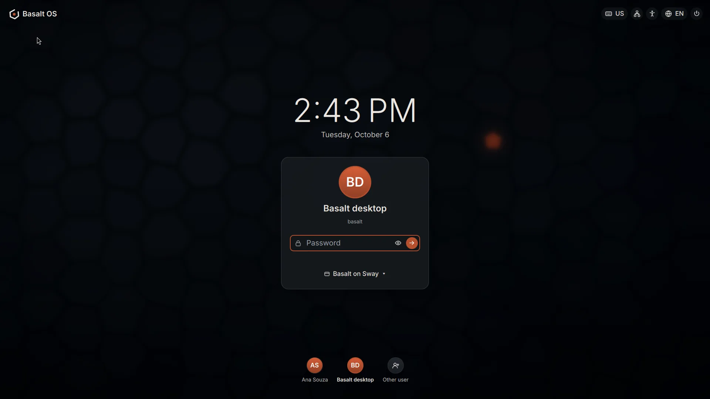

| | |
|---|---|
| 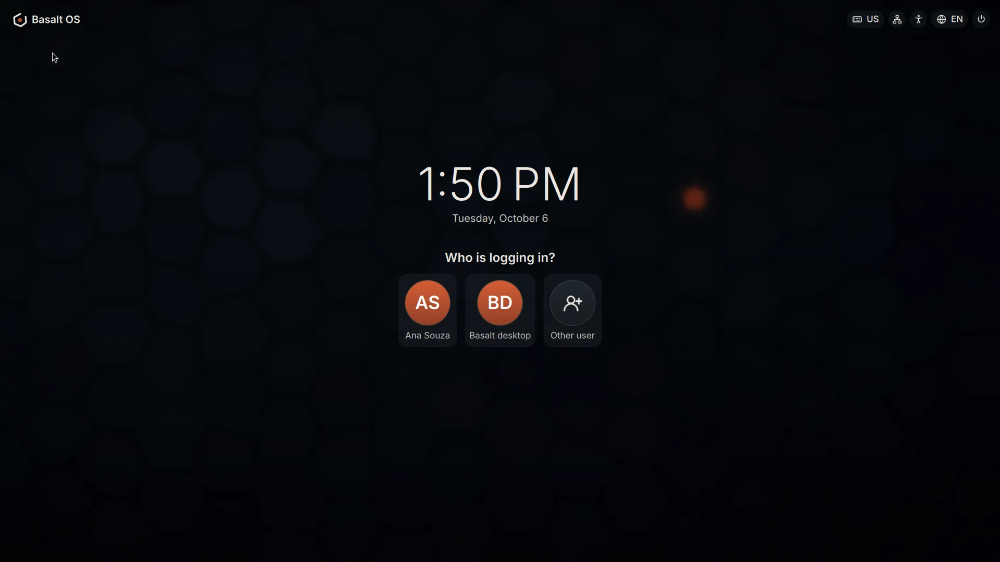 | 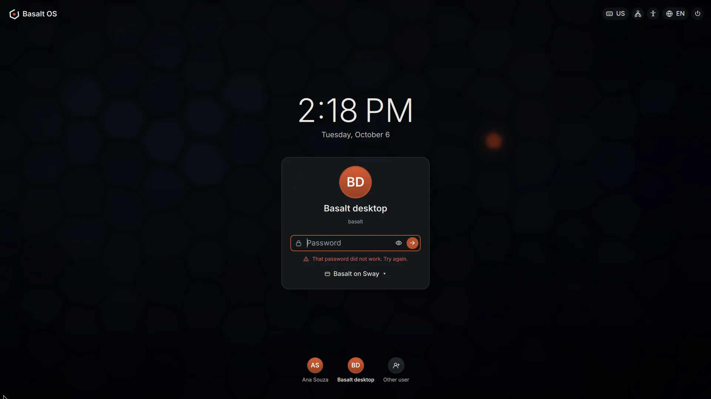 |
| Several people, nobody remembered | A wrong password says so |
| 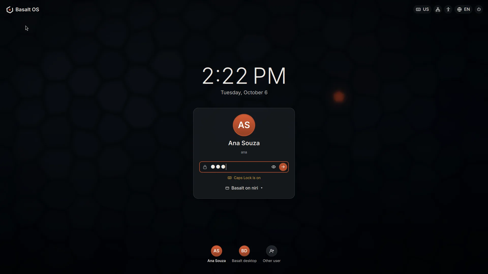 | 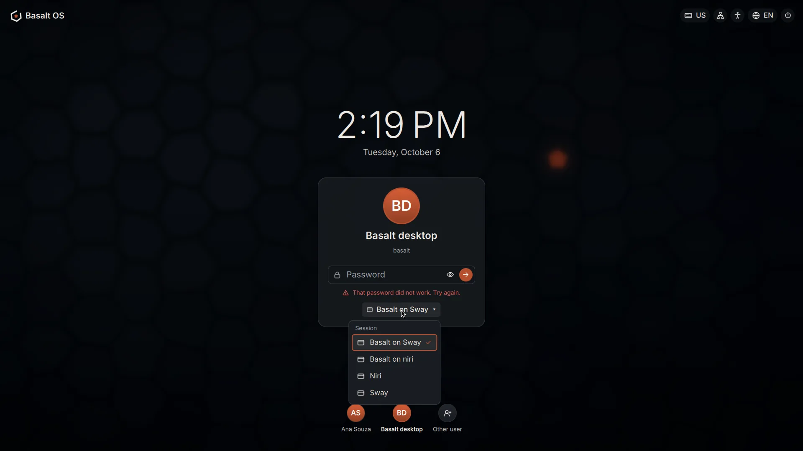 |
| Caps Lock, from the keyboard's LED | The session, remembered per person |
| 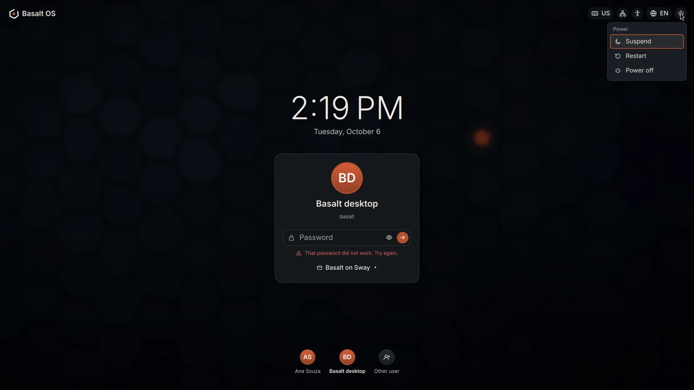 | 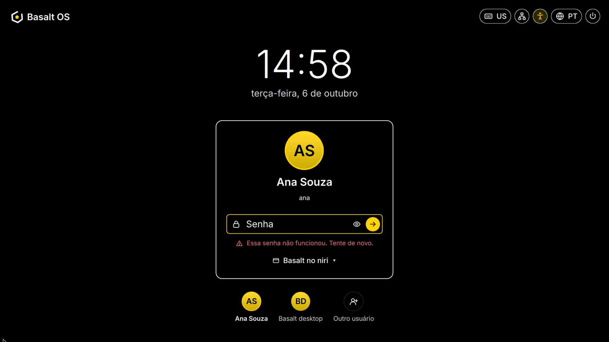 |
| Suspend, restart, power off | Brazilian Portuguese, large text and high contrast |
| 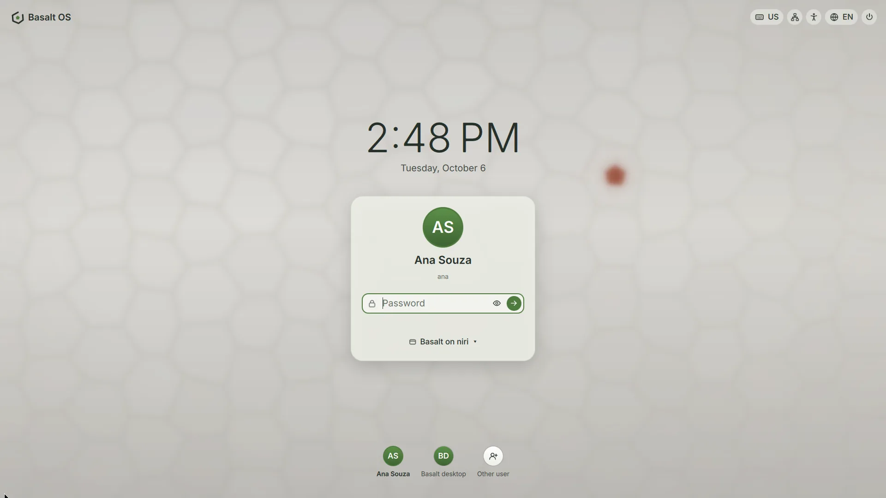 | 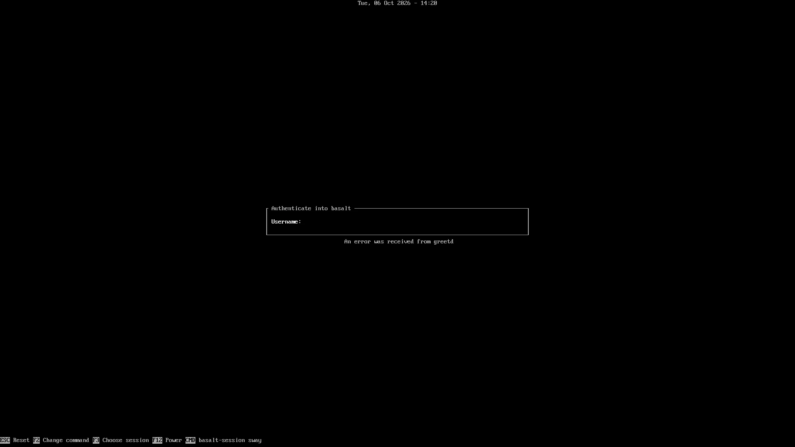 |
| `THEME=lichen`, `MODE=light` | When the graphical screen cannot run: the text login |

The boot splash before it (plymouth-theme-basalt, in the Basalt OS
repository) uses the same colors, mark and card:

| | |
|---|---|
| 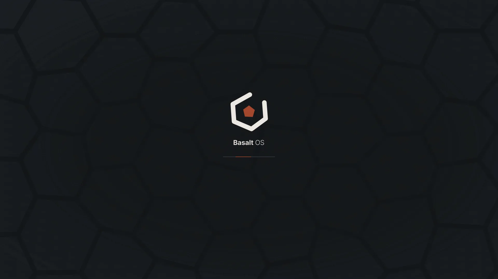 | 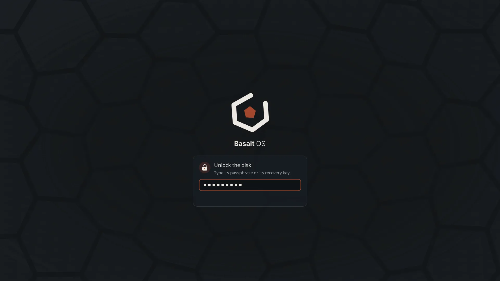 |
| The boot splash | The disk passphrase, on the splash |
| 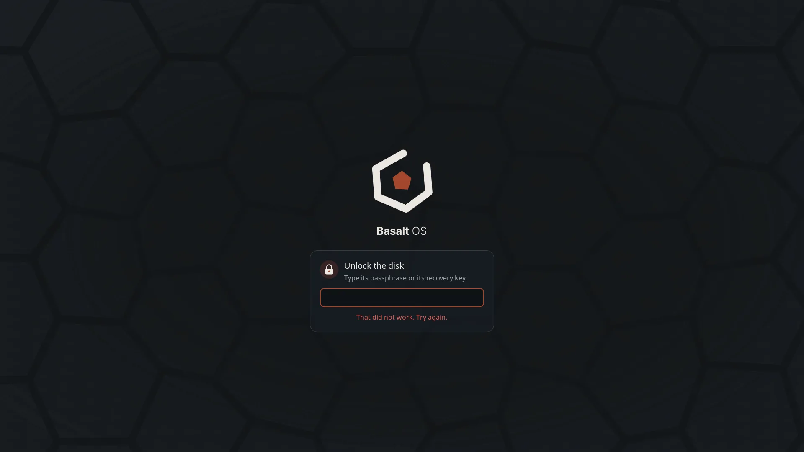 | |
| A wrong disk passphrase | |

## What it shows

- The Basalt wallpaper, softly blurred, the time and the date in the
  system's language and format.
- The person who logged in last, with their picture (the AccountsService
  icon, `/var/lib/AccountsService/icons/<user>`) or their initials, and the
  password field. With several people and nobody remembered, "Who is
  logging in?" first. "Other user" asks for a user name (people hidden
  with `HIDE_USERS` log in this way).
- The password can be shown while typing. Caps Lock is reported from the
  keyboard's LED (`/sys/class/leds/*::capslock`), or guessed from the
  typed letters when there is no LED. A wrong password shakes the card and
  says "That password did not work. Try again."; after three, it points at
  Caps Lock and the keyboard layout. A locked account (pam_faillock) says
  to wait. Other messages from PAM (an expiring password, a one-time
  code) are shown as PAM wrote them.
- The session, when more than one is installed: Basalt on Sway (the
  default), Basalt on niri (basalt-shell-niri), and other installed
  sessions. Each person's last choice is remembered.
- At the top right: the keyboard layout (click to switch when the system
  has several), the network (NetworkManager), the battery (UPower, laptops
  only), accessibility (large text, high contrast), the language of the
  screen (English, Brazilian Portuguese) and power (suspend, restart,
  power off, through logind; polkit decides as for any local session).
- After the password, the card and the blur fade out and the session
  starts on the same wallpaper.

An account without a password is never logged in just because it was
picked: the person still presses Enter.

Keyboard: Tab moves between the controls (each has a visible focus ring
and a name for screen readers), Enter logs in or opens the focused menu,
arrows move in a menu, Escape closes it or goes back from "Other user".
Ctrl+Alt+F2 and the other text consoles stay reachable.

## How it works

```
greetd (xdm_t)
 └─ greeter-session            /usr/libexec/basalt-greeter, greetd's greeter command
     ├─ basalt-greeter         basalt_greeter_t: environment, keyboard layout, sway
     │   └─ sway               greeter's sway.conf: no bindings, no bar, no XWayland
     │       └─ greeter-ui     Quickshell + watchdog, then `swaymsg exit`
     │           └─ quickshell -p /usr/share/basalt-greeter/qml   (GREETD_SOCK)
     └─ tuigreet               only when the graphical greeter cannot run
```

greetd starts `greeter-session` as its greeter user on the first virtual
terminal (`/etc/basalt/greetd.toml`, from basalt-desktop). The UI talks to
greetd through Quickshell's greetd client: `create_session`, the answers
to PAM's questions, `start_session` with the session's command and
environment (`XDG_SESSION_TYPE`, `XDG_SESSION_DESKTOP` and
`XDG_CURRENT_DESKTOP` from the session file's `DesktopNames`). greetd runs
PAM and starts the session; the greeter never does.

The greeter keeps two places:

| Path | What |
|---|---|
| `/run/basalt-greeter` | `ready` and `status` (how the last run ended), `failures` (this boot), `xdg/` (the greeter's runtime directory: Wayland and sway sockets), `sway.log`, `ui.log` |
| `/var/cache/basalt-greeter` | `state.json`: the last user, each person's session, large text, high contrast, language. Never a password. Also the greeter user's caches (Mesa, fontconfig, QML) |

Both are created by `basalt-greeter.conf` in tmpfiles.d, owned by greetd's
user.

### When it cannot run

`greeter-session` starts the text login (tuigreet, with the Basalt session
as default) instead of the graphical screen when:

- `/etc/basalt/greeter.conf` says `GREETER=text`;
- there is no display device (`/dev/dri/card*`);
- the graphical greeter failed twice since boot;
- the graphical greeter fails now: it crashed, sway could not start, or the
  screen never reported itself drawn within 30 seconds (the watchdog in
  `greeter-ui` waits for `/run/basalt-greeter/ready`). tuigreet starts at
  once on the same terminal.

Each fallback is written to the journal (`journalctl -t basalt-greeter`).

### Configuration

`/etc/basalt/greeter.conf`:

| Key | Default | |
|---|---|---|
| `GREETER` | `graphical` | `text` for the text login |
| `THEME` | `basalt` | `basalt`, `lichen` or `tide` |
| `MODE` | `dark` | `dark` or `light` |
| `HIDE_USERS` | | user names not listed (comma separated) |
| `DEFAULT_SESSION` | `basalt-sway.desktop` | for people who never logged in here |

The login screen does not read people's own theme settings: it cannot
read their home directories (see below), and the theme is a system
choice. An administrator sets it here.

## Security

- SELinux: the graphical greeter runs in `basalt_greeter_t`
  (`selinux/basalt_greeter.te`, package basalt-greeter-selinux), entered
  when greetd's greeter (`xdm_t`) runs `/usr/libexec/basalt-greeter/basalt-greeter`.
  It may use the display and input devices logind hands over, connect to
  greetd's socket, read `/etc/passwd`, AccountsService pictures, the
  session files, themes and fonts, talk to logind, NetworkManager and
  UPower on the system bus, and write its two directories. It has no
  access to `/etc/shadow`, to home directories or user runtime
  directories, no session bus, no network sockets; QML runs interpreted
  (no executable memory for QML; Mesa's software renderer still needs
  `execmem` on machines without a GPU). The text fallback runs in greetd's
  own domain, so a broken policy cannot lock anyone out.
- The password goes from the field to greetd and nowhere else: it is
  never logged (Quickshell's own debug output censors it, and the greeter
  turns debug output off), never written, and cleared from the field as
  soon as it is sent.
- The greeter's environment cannot steer Qt (no plugin or import paths,
  no preload).

## Tests

- `make test-greeter` (Node): the greeter's logic, `greeter/logic.js`
  (passwd and session files, quoting of `Exec`, session and user choice,
  language, PAM messages, Caps Lock, the remembered state).
- `go test ./internal/greetd/`: greetd's protocol and a fake greetd with
  greetd 0.10's answers, among them the error it sends for the cancel
  that follows a refused password (the greeter must not show it).
- `go test ./internal/i18n/`: every message of the greeter has a
  translation in every catalog (`greeter/locale/`).
- `lab/greeter/e2e-fake.sh`: the real UI in a headless sway against the
  fake greetd, typed into with wtype: wrong password, right password,
  each person's remembered session, status 0, no password in any log.
- In a lab VM (`lab/greeter/`): the real greetd and PAM, two people, wrong
  password, session choice, power menu, the fallback to tuigreet, SELinux
  enforcing with no denials.
